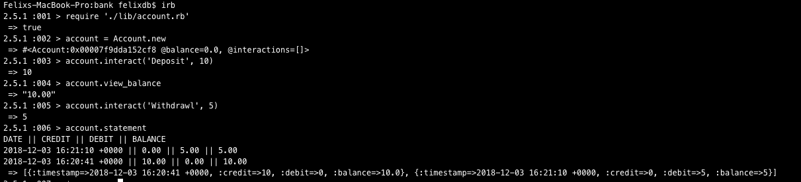

# Bank Tech Test
This tech test was coded to exhibit that I can test drive a object oriented
project. I was provided with some requirements: https://github.com/makersacademy/course/blob/master/individual_challenges/bank_tech_test.md

## Features
To use this project you must go into irb, require the file with the account logic in it and create an instance of an account.
```
$ irb
$ require './lib/account'
$ account = Account.new
```
### Deposit
To deposit £10
```
account.interact('Deposit', 10)
```
### Withdraw
To withdraw £10
```
account.interact('Withdrawl', 10)
```

### Statement
To view your statement
```
account.statement
```

### Full example

